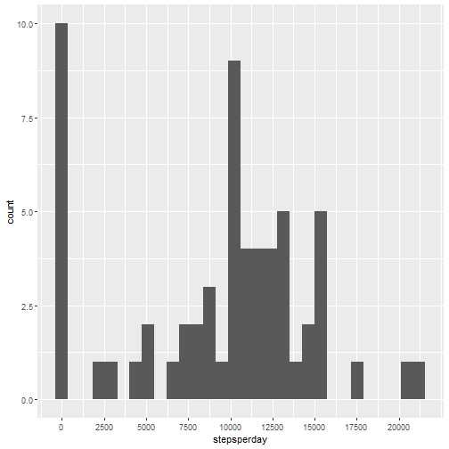
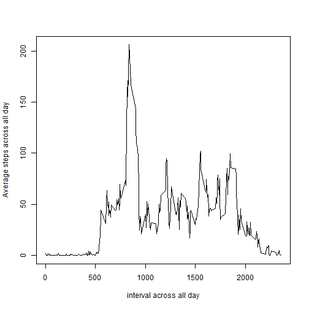
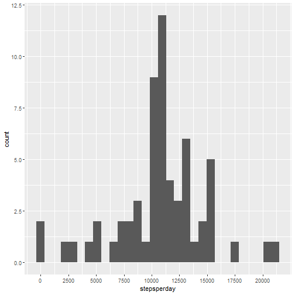
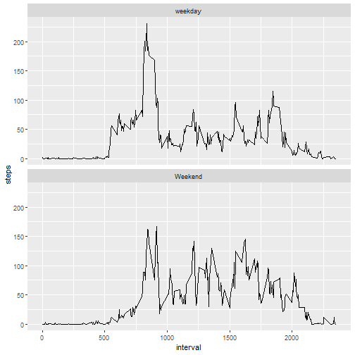

This assignment will be described in multiple parts.

### Loading and preprocessing the data

Show any code that is needed to

* Load the data (i.e. read.csv())
* Process/transform the data (if necessary) into a format suitable for your analysis


```r
ActivityData <- read.csv("activity.csv", header = TRUE)
str(ActivityData)
```

```
## 'data.frame':	17568 obs. of  3 variables:
##  $ steps   : int  NA NA NA NA NA NA NA NA NA NA ...
##  $ date    : Factor w/ 61 levels "2012-10-01","2012-10-02",..: 1 1 1 1 1 1 1 1 1 1 ...
##  $ interval: int  0 5 10 15 20 25 30 35 40 45 ...
```

```r
summary(ActivityData)
```

```
##      steps                date          interval     
##  Min.   :  0.00   2012-10-01:  288   Min.   :   0.0  
##  1st Qu.:  0.00   2012-10-02:  288   1st Qu.: 588.8  
##  Median :  0.00   2012-10-03:  288   Median :1177.5  
##  Mean   : 37.38   2012-10-04:  288   Mean   :1177.5  
##  3rd Qu.: 12.00   2012-10-05:  288   3rd Qu.:1766.2  
##  Max.   :806.00   2012-10-06:  288   Max.   :2355.0  
##  NA's   :2304     (Other)   :15840
```

### What is mean total number of steps taken per day?
For this part of the assignment, you can ignore the missing values in the dataset.

Calculate the total number of steps taken per day


```r
library(dplyr)
Steps_per_day <- ActivityData %>%
  group_by(date)%>%
  summarise(stepsperday = sum(steps, na.rm = TRUE))
```

If you do not understand the difference between a histogram and a barplot, research the difference between them. Make a histogram of the total number of steps taken each day


```r
library(ggplot2)
ggplot(data = Steps_per_day, aes(stepsperday))+
  geom_histogram()+
  scale_x_continuous(breaks = seq(0,20000,2500))
```

```
## `stat_bin()` using `bins = 30`. Pick better value with `binwidth`.
```



Calculate and report the mean and median of the total number of steps taken per day


```r
mean(Steps_per_day$stepsperday)
```

```
## [1] 9354.23
```

```r
median(Steps_per_day$stepsperday)
```

```
## [1] 10395
```

### What is the average daily activity pattern?

Make a time series plot (i.e. type = "l") of the 5-minute interval (x-axis) and the average number of steps taken, averaged across all days (y-axis)


```r
Activity2 <- ActivityData %>%
  group_by(interval)%>%
  summarise(averageSteps = mean(steps, na.rm = TRUE))

plot(x = Activity2$interval ,y = Activity2$averageSteps , type = "l", xlab = "interval across all day",ylab = "Average steps across all day")
```



Which 5-minute interval, on average across all the days in the dataset, contains the maximum number of steps?


```r
Activity2$interval[which.max(Activity2$averageSteps)]
```

```
## [1] 835
```

### Imputing missing values

Calculate and report the total number of missing values in the dataset (i.e. the total number of rows with NAs)


```r
summary(ActivityData)
```

```
##      steps                date          interval     
##  Min.   :  0.00   2012-10-01:  288   Min.   :   0.0  
##  1st Qu.:  0.00   2012-10-02:  288   1st Qu.: 588.8  
##  Median :  0.00   2012-10-03:  288   Median :1177.5  
##  Mean   : 37.38   2012-10-04:  288   Mean   :1177.5  
##  3rd Qu.: 12.00   2012-10-05:  288   3rd Qu.:1766.2  
##  Max.   :806.00   2012-10-06:  288   Max.   :2355.0  
##  NA's   :2304     (Other)   :15840
```

```r
sum(is.na(ActivityData))
```

```
## [1] 2304
```

Devise a strategy for filling in all of the missing values in the dataset. The strategy does not need to be sophisticated. For example, you could use the mean/median for that day, or the mean for that 5-minute interval, etc.


```r
ActivityData%>%
  group_by(interval)%>%
  mutate(steps = ifelse(is.na(steps), mean(steps, na.rm = TRUE), steps))
```

```
## # A tibble: 17,568 x 3
## # Groups:   interval [288]
##     steps date       interval
##     <dbl> <fct>         <int>
##  1 1.72   2012-10-01        0
##  2 0.340  2012-10-01        5
##  3 0.132  2012-10-01       10
##  4 0.151  2012-10-01       15
##  5 0.0755 2012-10-01       20
##  6 2.09   2012-10-01       25
##  7 0.528  2012-10-01       30
##  8 0.868  2012-10-01       35
##  9 0      2012-10-01       40
## 10 1.47   2012-10-01       45
## # ... with 17,558 more rows
```

Create a new dataset that is equal to the original dataset but with the missing data filled in.


```r
Updated_activity <- ActivityData%>%
  group_by(interval)%>%
  mutate(steps = ifelse(is.na(steps), mean(steps, na.rm = TRUE), steps))
```

Make a histogram of the total number of steps taken each day and Calculate and report the mean and median total number of steps taken per day. Do these values differ from the estimates from the first part of the assignment? What is the impact of imputing missing data on the estimates of the total daily number of steps?


```r
library(ggplot2)
 Updated_activity_sum <- Updated_activity %>%
  group_by(date)%>%
  summarise(stepsperday = sum(steps))
 
ggplot(data = Updated_activity_sum, aes(stepsperday))+
  geom_histogram()+
  scale_x_continuous(breaks = seq(0,20000,2500))
```

```
## `stat_bin()` using `bins = 30`. Pick better value with `binwidth`.
```




Yes, these values are different from first part of assignment since NA is replaced by mean value for that particular interval.

Steps per day is changed like frequency of 0 steps per day is decreased and highest frequency of step is also changed.

### Are there differences in activity patterns between weekdays and weekends?

Create a new factor variable in the dataset with two levels -- "weekday" and "weekend" indicating whether a given date is a weekday or weekend day.


```r
Updated_activity$date <- as.Date(Updated_activity$date)
table(weekdays(Updated_activity$date))
```

```
## 
##    Friday    Monday  Saturday    Sunday  Thursday   Tuesday Wednesday 
##      2592      2592      2304      2304      2592      2592      2592
```

```r
Updated_activity$DayType = ifelse((weekdays(Updated_activity$date) == "Saturday")|(weekdays(Updated_activity$date) == "Sunday") , "Weekend","weekday")
table(Updated_activity$DayType)
```

```
## 
## weekday Weekend 
##   12960    4608
```

Make a panel plot containing a time series plot (i.e. type = "l") of the 5-minute interval (x-axis) and the average number of steps taken, averaged across all weekday days or weekend days (y-axis). The plot should look something like the following, which was created using simulated data:


```r
UADayType <- aggregate(steps ~ interval+DayType, Updated_activity, FUN = mean)

ggplot(data = UADayType, aes(x= interval, y = steps))+
  geom_line()+
  facet_wrap(DayType~., nrow = 2)
```



### Thank You for reviewing it
